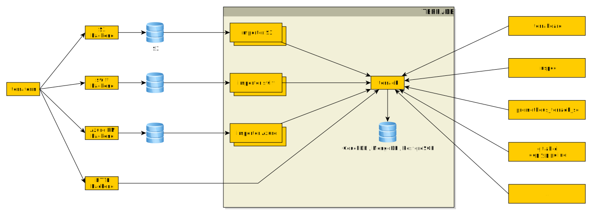

# TerraDB

A centralized database and REST API for Terraform data.

[](https://hub.docker.com/r/camptocamp/terradb/)
[](https://goreportcard.com/report/github.com/camptocamp/terradb)
[](https://godoc.org/github.com/camptocamp/terradb/pkg/client)
[](https://gitter.im/camptocamp/terradb)
[](https://travis-ci.org/camptocamp/terradb)
[](https://coveralls.io/github/camptocamp/terradb?branch=master)
[](http://www.camptocamp.com)


## What is it?


TerraDB is a centralized database and REST API dedicated to hosting and serving
Terraform data. It can be used as a native HTTP backend to store Terraform
remote states.

Eventually, [Terraboard](https://camptocamp.github.io/terraboard) will be
ported to use TerraDB as a backend, and we are also working
on [InSpec](https://www.inspec.io/) plugins to perform compliance and
acceptance tests on Terraform resources.


## Requirements

* A MongoDB (>= 3.4) database


## Install from code

```shell
$ go get github.com/camptocamp/terradb 
```


## Usage

### Command line options

```
Usage:
  terradb [OPTIONS]

Application Options:
  -V, --version           Display version.

MongoDB options:
      --mongodb-url=      MongoDB URL [$MONGODB_URL]
      --mongodb-username= MongoDB Username [$MONGODB_USERNAME]
      --mongodb-password= MongoDB Password [$MONGODB_PASSWORD]

API server options:
      --api-address=      Address on to bind the API server (default: 127.0.0.1) [$API_ADDRESS]
      --api-port=         Port on to listen (default: 8080) [$API_PORT]
      --page-size=        Page size for list results (default: 100) [$API_PAGE_SIZE]

Help Options:
  -h, --help              Show this help message
```


### As a docker container

```shell
$ docker run -e MONGODB_URL="mongodb://mongo" \
             -e MONGODB_USERNAME="user" \
             -e MONGODB_PASSWORD="pass" \
             -e API_ADDRESS="0.0.0.0" \
             -p 8080:8080 camptocamp/terradb
```


## Using as a Terraform remote backend


You can use TerraDB as an HTTP remote backend for Terraform:

```hcl
terraform {
  backend "http" {
    address = "http://<terradb>:<port>/v1/states/<name>"
    lock_address = "http://<terradb>:<port>/v1/states/<name>"
    unlock_address = "http://<terradb>:<port>/v1/states/<name>"
  }
}
```

Note: do not use the `/` character in the project name.


## API Documentation

The current API root is `/v1`.

Below is a list of endpoints, usable with the `GET` verb.

Endpoints returning lists are paginated; the page number and total number of results
appear in a `metadata` section of the results.


### `/states`

Returns the latest serial of each state stored in the database, along with its
lock information.


### `/states/{name}`

Returns the latest serial of a single state by its name, along with its lock
information.


### `/states/{name}/serials`

Returns all serials of a single state by its name. Lock information is not
provided.


## Architecture schema


